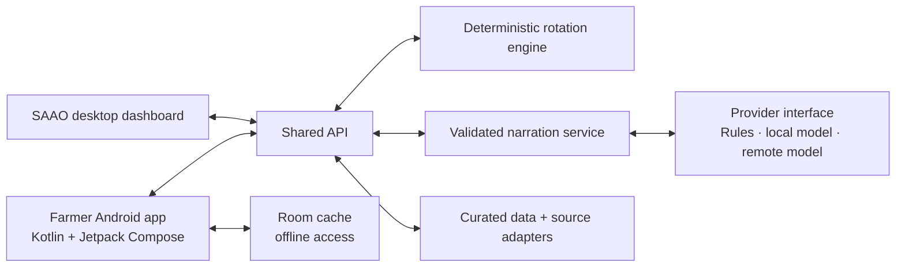

# Project EDEN — Earth Data & Environment Navigator

**NASA Space Apps Challenge 2026 · Team WinR · Challenge 07: Field Shift**

EDEN is a Bangla-first crop-rotation decision-support system for Bangladesh. Its farmer-facing service is **মাঠের কথা · Mather Kotha** ("the field's words"): before the Rabi season the farmer's phone rings, and a Bangla call names the two best rotations for their land, water, cattle and priorities, with 25 seasons of NASA Earth observations behind them. Agricultural officers (SAAOs) work from a desktop dashboard, and farmers with smartphones can use the Android app. Every number traces back to the research data in this repository.

## Project status (4 October 2026)

`main` holds all of the team's work up to 4 October: the research, the apps, Rayyanul's Android fixes (PR #3), the farmer's own crops with the Awaj phone channel, and muhammadTasin's weather and cattle advisories; a GitHub Action adds the daily NASA update. Branch `feature/map-and-pesticide-data` adds a real map of Bangladesh to the dashboard and works on the known limits: NASA SEDAC pesticide estimates in the tips, waterlogging from NASA soil wetness, jute's measured crop coefficient, price-based incomes for five more crops, and the story site's fonts in the app. Branch `feature/merge-edith-web` builds on it and brings in muhammadTasin's [Edith_Web_App_Connectivity](https://github.com/muhammadTasin/Edith_Web_App_Connectivity) work, so one server serves the website and the Android app: the weather forecast, the upazila list and the cattle module on the server, and on the dashboard a role picker, the web farmer portal and the weather and cattle tabs, in the story site's look. Branch `feature/local-advice` builds on that and makes the advice fit each upazila: its land type from NASA elevation and Landsat surface water with BRRI's survey of what farmers grow, the haor's flash floods from NASA rain over the Meghalaya hills, district yields and harvest-price swings, NASA groundwater and pesticide data in the scores, and today's NASA soil moisture before the winter sowing (see [Branches](#branches)):

| Part | Folder | What works |
|---|---|---|
| Research and data | `research/` | NASA and local datasets with their checks, the 25-season replay for the Tanore pilot, signals for five pilots, and the generator for the app's data release |
| Rotation engine | `packages/rotation-engine/` | 7 scores over replayed seasons. The Talanda pilot keeps its 5 researched rotations (data release `tanore-2026.09.30`, research commit `0469020`); every other upazila is planned from 17 crops (`crop_choice_replay.json`) on its district's replay (`national_replay.json`), its land type, what its farmers grow now and its district's yields (`upazila_profile.json`). With the farmer's crops named, it plans the whole year around them |
| API | `services/api/` | One server for the website and the Android app ([API contract](docs/api-contract.md)): advice, crop choice, Bangla request reading, soil-and-water tips, Awaj calls, the weather forecast for 500 upazilas, NASA POWER observations and the cattle farm-outline (AOI) pipeline |
| SAAO dashboard | `apps/saao-dashboard/` | A role picker first (visitor, farmer, officer; each sees its own tabs); the web farmer portal with the Android app's five tabs (today, weather, river erosion, assistant, my farm); the weather tab (Open-Meteo forecast, NASA POWER, hourly cattle THI); the cattle tab (farm outlines on a map, background jobs, THI advice); any of the 544 upazilas, picked from a list or on a map of Bangladesh coloured by NASA layers; Bangla and English, the farmer's crops and main crop (with a no-rice switch), officer desk, soil-and-water tips, early warnings, environment ledger, daily NASA conditions and voice-to-plan flow |
| Android app | `apps/farmer-mobile/` | Farmer card, weather and cattle advisories through the configured Edith API, river erosion, Bangla voice assistant and crop planning when the configured API supports `/api/v1/voice/answer`, sign-in, farm profile editing; the story site's colours, sharp corners and fonts (Anek Bangla and Hind Siliguri, bundled for offline use) |
| Screen designs | `design/` | Six SAAO desktop screens and the portrait mobile companion |
| Daily NASA update | `research/live/` | NASA POWER every day for all 544 upazilas (64 districts), GPM IMERG rain at 10 km with an Earthdata Login, and the live haor flash-flood check with the MODIS flood map |

The dashboard advises any of the 544 upazilas (pick the district and upazila at the top of the overview); Talanda union (Tanore) remains the most detailed pilot. Sample farmers, the farm profile and the income scores are sample values and are labelled as such on screen. The story site that presents the project lives in its own repository, [Mati-Kohon](https://github.com/Tasrif-Ahmed-Mohsin/Mati-Kohon). Changes are listed, newest first, in [`CHANGELOG.md`](CHANGELOG.md).

## Run it

```bash
npm install
npm test          # 16 engine tests, 7 cattle tests and every API check
npm start         # API and SAAO dashboard on http://localhost:4000
npm run call:test -- --to 01XXXXXXXXX --crops sunflower,lentil   # the Bangla call script; a dry run until Awaj is set up
```

- **Place:** pick a district and upazila at the top of the overview; the advice, replay, alerts and rain follow it, and the browser remembers it. Rajshahi → Tanore is the detailed Talanda pilot.

- **Language:** the বাংলা / EN buttons in the dashboard header switch every text; the browser remembers the choice.
- **Krishi officer desk:** tab ৬ / 6, demo access code `talanda-demo` (set `EDEN_OFFICER_CODE` to change it). **Restore sample data** resets the sample farmers before a recording.
- **Farmer sign-in (app):** a farmer ID or phone number with the demo PIN `1234`. Both sign-ins are demo gates, not real authentication.
- **Weather:** `/api/v1/weather` fetches NASA POWER over the internet and caches it; offline, it serves a fixed baseline marked as not live.
- **Android app:** build steps and screens are in [`apps/farmer-mobile/README.md`](apps/farmer-mobile/README.md). The emulator reaches the API at `http://10.0.2.2:4000`; run its unit tests with `./gradlew test` in `apps/farmer-mobile`.

### Every upazila

Outside the Talanda pilot the engine plans the year from every crop it replays, and what it knows about the place decides which plans are possible and how they score (`research/export/upazila_profile.py` writes `packages/rotation-engine/src/data/upazila_profile.json`; `data/land.ts` holds the land rules):

- **Land type.** The upazila's usual land comes from NASA NASADEM elevation and JRC Landsat surface water (water seen 3–6 months a year is seasonal flooding; longer is rivers, ponds and shrimp ghers) with BRRI's 2014-15 survey of every upazila (Boro–Fallow–Fallow, no monsoon crop, on much of the land): 38 upazilas low, 35 medium low, 60 high (Barind, the northern piedmont, the hills), the rest medium high. A farmer's own land type overrides it (the planner, a spoken "নিচু জমি", the officer's observation, or the optional keypad question). Low land holds no Aman, monsoon crop or summer crop, and its winter crop goes in once the water leaves (~1 December, after BRRI's haor seedbed dates); upland monsoon crops go on high land only; the advice says which land it assumed and why.
- **What farmers grow now.** The upazila's main BRRI pattern is added as a plan of its own (`currentPractice`), with the same crops plus a summer crop in the gap (mungbean, sesame, jute or Aus, whichever fits), so a farmer sees what a change gains or costs. Default plans keep Aman wherever the land allows it; a non-rice monsoon crop comes in when the farmer leaves rice out.
- **The haor's flash floods.** In the seven haor districts, on medium-low and low land, a winter or summer crop harvested after the first upstream burst (100 mm or more in 3 days over the Meghalaya hills, NASA GPM IMERG, which came before every flash flood FFWC reported) in 40% of the 25 springs or more is not offered, and the flood score falls with that share. Low land there gets an early Boro (BRRI dhan88 on the BRRI calendar, replayed like the other crops) cut ~3 April, caught in 6 of 25 springs, where BRRI dhan28 transplanted on 1 February (cut ~14 May) was caught in 21.
- **District yields and bad price years.** Each crop's return moves with its district's BBS yield against the national one (HYV rows for rice and potato), the lower tenth of district yields where the district grows too little to say; the score takes the middle of a typical year and a year at each crop's lowest BBS harvest price of 2021-22 to 2024-25 (potato fell to 45%, rice to 77–79%). Crops with no BBS price (soybean, sunflower, barley) get a lower-quartile winter crop's return moved by their own district yield.
- **NASA data in the scores.** Irrigation counts up to 1.5 times where NASA GLDAS-2.2 groundwater falls faster than in the median district (1.48 in Nawabganj), never less on the coast; the pest score adds NASA SEDAC PEST-CHEMGRIDS (the plan's pesticide against Aman-Boro at the upazila); the soil score weighs legumes and kept straw more where the SRDI atlas finds organic matter low.
- **Today's soil.** From 1 September to 15 December, when the daily NASA reading finds the upazila's soil dry (drier than the same date in past years), an upland winter crop counts the 50 mm of soil water the replay credits after Aman as irrigation instead, and the plan says to sow right after the Aman harvest, with a light irrigation first if the topsoil is dry.
- **On the coast** a winter fallow pattern (Fallow–Fallow–T. Aman on most land) is flagged as likely salinity, which the engine does not model yet, with the salt-tolerant varieties from the research tables.

Every advice carries `local_context` (land type and evidence, the patterns, hazards with one alert each, notes); the overview shows the most serious hazard as its alert. Across the 544 upazilas the default plans (before today's soil reading) now name 29 different rotations led by 9 different winter crops, where all 544 used to get BRRI dhan71 then lentil.

`python research/explore/national_replay.py` runs the Tanore replay's method (FAO-56 water balance, BRRI and BARI calendars, heat at flowering and grain filling) at each of the 64 districts' NASA POWER and GPM IMERG point for 2001–2025, with temperatures corrected against the nearest BMD station within 100 km, and writes `packages/rotation-engine/src/data/national_replay.json`. `packages/rotation-engine/src/data/location.ts` points the engine at the chosen place: the Talanda pilot, or an upazila using its district's replay. At Rajshahi district it reproduces Tanore's research figures closely (BRRI dhan71: 7 of 25 rescue seasons; Boro 790 mm against 797 mm).

Where a place has no data yet, the dashboard says so instead of borrowing Tanore's: SMAP soil moisture, MODIS greenness and land use are pilot-only so far; fertilizer doses use the SRDI Talanda card until each upazila's card is added; upazila names are in English. `GET /api/v1/places` lists the places, `GET /api/v1/overview?place=<id>` and `POST /api/v1/advice` with `unionId: <id>` follow the choice.

### The farmer's own crops

The five fixed rotations always end with lentil on top, because lentil needs the least water. Now the farmer (or the officer for them) names the crops they want, and the engine plans the year around them: Aman, a winter (Rabi) crop, and optionally a pre-monsoon (Kharif-1) crop before the next Aman.

- **16 crops.** Winter: lentil, mustard, wheat, Boro (their research-release records), potato, maize, sunflower, chickpea, grass pea, sweet potato, barley and soybean. Before Aman: mungbean, sesame, Aus rice and summer sunflower. Groups work too ("ডাল" means the best pulse). Jute, onion, garlic, groundnut and vegetables are recognised and reported as not modelled yet.
- **From NASA data, per place.** `python research/explore/crop_choice_replay.py` replays each crop at the Talanda pilot and all 64 district points (NASA POWER ET0 with BMD-corrected temperatures, GPM IMERG rain, FAO-56 crop coefficients, BARI/BRRI/BBS calendars, 2001–2025), sowing on every 10th day of its window, and writes `packages/rotation-engine/src/data/crop_choice_replay.json`: net irrigation (median and p10–p90), crop water use and hot days at the sensitive stage. Fertilizer comes from the SRDI Talanda card (barley and soybean from the BARI handbook).
- **The calendar decides what fits.** A winter crop starts on the first replayed date after its Aman frees the field and before the handbook deadline (grass pea goes in 15 days before the Aman harvest, as a relay crop). A Kharif-1 crop starts a week after the winter harvest and must leave the field a week before the next Aman is transplanted. Every Aman variety is tried.
- **Ranking.** Plans holding more of the named crops come first, then the farmer's weighted score; the response says when growing both crops in one year costs score (for example, summer sunflower meets June heat). If two named crops are both winter crops, the advice says so and suggests splitting the field or alternating years. It also lists the summer crops that fit the gap after the winter harvest.
- **Where.** `POST /api/v1/advice` with `preferredCrops: ["sunflower", "lentil"]`; `GET /api/v1/crops?place=<id>` lists every crop with the Aman varieties it fits after and its irrigation need there. In the dashboard planner, tick the crops under "কৃষক কোন ফসল করতে চান?". Without named crops the five fixed rotations are unchanged.

Scores stay honest about gaps: potato, maize, Aus and jute use the research net returns in `research/crops/crop_parameters.csv`; chickpea, grass pea, sweet potato, mungbean and sesame use an estimate from BBS 2024-25 harvest prices and national yields with costs at 65% of the crop's value (`research/explore/minor_crop_returns.py`: the census crops spend 51-66%, lentil and mungbean surveys 62-70%); soybean, sunflower and barley, with no BBS harvest price, keep a neutral income score. Heat limits not in that table (potato 30 °C, maize and chickpea 35 °C, mungbean and sesame 40 °C, sunflower and soybean 35 °C, barley 30 °C) are literature values marked as assumed.

### Any main crop, with or without rice

`heroCrop` names the farmer's main crop: wheat, sunflower, potato, jute, anything in the menu. Every plan holds it, and the engine fills the rest of the year from every crop it knows. `avoidCrops: ["rice"]` leaves out Aman, Boro and Aus (or name single crops). Without Aman the monsoon slot holds a non-rice crop or stands empty:

- **Monsoon crops without rice** come from the BARI handbook's second windows: soybean (sown 15 Jul-15 Aug), mungbean (8 Aug-7 Sep) and sesame (15 Aug-15 Sep), replayed like the others, with two counts while they stand: days with 50 mm or more of IMERG rain, and days when NASA POWER's topsoil wetness (MERRA-2, 0 dry to 1 saturated) is 0.9 or more. Their flood score starts from the land type and falls with the share of waterlogged days: monsoon mungbean on medium-high land scores 0.52 at Godagari (7 of its 60 days) and 0.37 in Sylhet Sadar (40 of 60).
- **Jute** (sown 15 Apr-5 May, harvested in August, SRDI dose, research net return) is modelled. FAO-56 lists no crop coefficient for it, so it uses the values measured for tossa jute at ICAR-CRIJAF, Barrackpore, on the same Gangetic plain (Barman, Kundu, Ghorai and Mitra 2014, Journal of Agricultural Physics 14:67-72): 0.72 at the start, 1.26 mid-season, 0.46 at the end.
- **Scores follow the crops grown**: no Aman means no rescue irrigation, no rice straw, no Aman urea; a year without rice leaves rice pests no host and keeps the soil unpuddled.
- **A main crop in its own season comes first** (winter sunflower before summer sunflower), and a summer crop that runs into August (jute) shows its harvest at the start of the year's timeline.
- The Bangla reader marks a main crop ("প্রধান ফসল গম", "শুধু গম", or the only crop named) and refusals ("ধান করব না" leaves out all rice; "বোরো ধান করব না" only Boro). The dashboard planner has a main-crop list and a "ধান ছাড়া" switch.

### Soil and water tips

Every option carries tips (`stewardship`) with numbers from its own records, against the usual Aman-Boro rotation at the same place: groundwater pumped per bigha (the NASA replay) with NASA GRACE-GLDAS groundwater's change; urea and TSP per bigha (SRDI cards) and what legumes add; the rice-pest cycle and safe pesticide use; the upazila's soil gaps from the SRDI Soil Fertility Atlas (low organic matter, strong acidity, low zinc or boron; `research/export/soil_atlas_export.py`); and metals: arsenic rides on irrigation water (so the tip scales with the plan's pumping), cadmium on phosphate fertilizer, lead, chromium and mercury on factory and tannery waste water. No satellite measures metals in soil, so those tips are sourced guidance (BGS/DPHE, Meharg and Rahman 2003, EU 2019/1009, WHO 2006), and the farmer is pointed to a well test and an SRDI soil test.

The pesticide tip carries numbers from NASA SEDAC's Global Pesticide Grids, PEST-CHEMGRIDS v1.01 (Maggi et al. 2019, Scientific Data 6:170). `python research/acquire/pest_chemgrids.py` downloads the 2.27 GB netCDF archive with an Earthdata Login (NASA's catalogue points at a dead `sedac-beta` address; the files are under `sedac-root`), and `python research/explore/pesticide_load.py` reads only Bangladesh out of it: the 2020 rate of each crop class's top 20 active ingredients, averaged over each upazila's 5-arc-minute cells and weighted by that crop's area (`pesticide_load.json`). Each crop in a plan adds its class's rate, so Aman then lentil comes out about 35% below Aman-Boro, jute then wheat without rice about 71% below, and a potato plan about 58% above. For Bangladesh the dataset re-analyses US surveys and FAOSTAT totals, so it is an estimate for comparing crops, and soil fumigants (metam, 1,3-dichloropropene, chloropicrin: 87% of its vegetable estimate at Tanore, a US practice) are left out.

### Phone calls and the farmer's voice (Awaj Digital)

`services/api/src/awaj.ts` speaks to Awaj Digital's API (https://awajdigital.com/api-docs). Awaj reads Bangla text aloud (`POST /broadcasts/direct-tts`, `language_code: bn-BD`), runs keypad surveys (keys 1–9, the pressed keys come back by webhook) and records calls that officers place from its call-centre widget. It does not turn a farmer's speech into text, so listening works in three ways:

1. **Keypad, now (Awaj survey).** The farmer presses a key per crop (`GET /api/v1/crops` returns the menu: 1 lentil, 2 mustard, 3 wheat, 4 potato, 5 maize, 6 sunflower, 7 mungbean, 8 Boro, 9 officer). Awaj posts the keys to `POST /api/v1/calls/survey-webhook`, which plans for those crops and calls the farmer back with the Bangla answer. Surveys play recorded prompts, so record `keypad.promptBangla` and upload it as an Awaj voice.
2. **Speech to text, then the same engine.** Any speech-to-text that handles Bangla gives a sentence; `POST /api/v1/voice/answer` reads the crops, exclusions ("বোরো করব না"), land type and priorities from it (`packages/rotation-engine/src/understand.ts`, rule-based so an officer can see why) and returns the call script and SMS. The dashboard's delivery screen does this with the browser's microphone (Chrome's Bangla speech recognition). For phone calls, the speech must be recorded first: officer calls through Awaj's call-centre widget come with a recording URL, or a provider whose IVR records a spoken answer, and the recording goes to a speech-to-text service.
3. **A conversational AI voice line, later.** Real-time speech needs a telephony provider that streams call audio (a SIP line with Asterisk or FreeSWITCH, or a cloud provider with media streams), streaming Bangla speech-to-text and text-to-speech; the engine still decides, and any model wording passes the narration gates.

Calls stay dry runs (they return the exact request) until `.env` has `AWAJ_API_TOKEN`, `AWAJ_SENDER` and `AWAJ_LIVE=1` (see `.env.example`); with live calls on, the call routes need an officer sign-in.

The keypad call, step by step: record the menu text (`npm run call:test -- --upload-menu menu.m4a` prints it and uploads the recording as the voice `mather-kotha-menu`); wait for Awaj to approve it (`--voices`); set `AWAJ_MENU_VOICE` (or `AWAJ_SURVEY_TEMPLATE` for a two-question template made in the Awaj dashboard), `AWAJ_OFFICER_NUMBER` for key 9 and `PUBLIC_BASE_URL` so Awaj can reach `/api/v1/calls/survey-webhook`; then `npm run call:test -- --keypad --to 01XXXXXXXXX --live`, or the dashboard's "কিপ্যাড মেনু কল" button. The farmer presses keys, Awaj posts them, and the webhook calls back with the plan. `npm run call:test -- --to 01XXXXXXXXX --place ADM3_Godagari --text "আমি সূর্যমুখী আর মসুর করতে চাই"` prints the script and, with `--live`, places one call and prints Awaj's per-number result.

### What the fields grow: MODIS greenness for every upazila

`python research/explore/national_greenness.py` reads the AppEEARS request `fieldshift_ndvi_national_20260927` (MODIS MOD13Q1 250 m NDVI at the 544 upazila centres, February 2000 to September 2026, plus VIIRS 500 m) and counts crops a year and the winter peak with the pilots' method (`field_cycles.py`). 530 upazilas have enough clear composites: Tanore went from 1.8 to 2.6 crops a year and its winter peak from 0.50 to 0.80 (the pilot's 9-pixel study read 0.81-0.83); parts of Bogura grow about 3. The overview shows it for any upazila (`greenness_upazila.json`). One pixel mixes fields, so it is context beside the replay, not a score input.

### A map of Bangladesh

The overview's satellite card is a real map (Leaflet with NASA GIBS imagery). All 544 upazilas (geoBoundaries outlines, thinned to 0.74 MB by `python research/export/map_export.py`, sent gzipped) are coloured by one of ten layers: crops a year, its change since 2001-06 and winter greenness (MODIS); Boro irrigation need (NASA replay) and groundwater decline (GLDAS), both per district; rain in the last 7 days (IMERG), 30-day rain against normal and root-zone soil wetness (the daily NASA update); pesticide on rice (PEST-CHEMGRIDS) and soil organic matter (SRDI). Underneath: OpenStreetMap, NASA MODIS or VIIRS true colour from yesterday, or the Blue Marble; on top: NASA's 3-day MODIS flood map, IMERG rain, SMAP root-zone moisture and MODIS 8-day NDVI. Hover shows the value, a click shows the upazila's facts with a button that plans for it, choosing a place in the list flies the map there, and a table lists the district's upazilas. `GET /api/v1/map/upazilas` serves the values.

### Daily NASA update (all 544 upazilas)

```bash
python research/acquire/imerg_nrt.py --days 10   # optional: GPM IMERG rain, needs an Earthdata Login in .env
python research/live/daily_update.py            # NASA POWER for every upazila, no login
```

The script writes `services/api/data/live/upazila_conditions.json`: for each upazila, rain (1, 7 and 30 days, and 30-day rain against the same dates in 2016–2025), maximum and minimum temperature, days at 35 °C or more, root-zone and surface soil wetness, and IMERG rain over 1, 3 and 7 days, each with its date. NASA POWER is about 3 days behind and IMERG 1 to 2 days. The dashboard overview shows it for any district and upazila, and `/api/v1/live/*` serves it.

The same run reads the **live haor flash-flood check**: the last 3 days of IMERG rain at Sohra, scaled up because IMERG's quick runs read about 9% below the final run there, against the levels tested on 25 springs (200 mm watch, 250 mm warning, 15 March to 15 May); the Jaintia Hills, Garo Hills and Barak valley, which feed the other haor districts, shown without tested levels yet; and NASA's MODIS flood map (3-day composite on GIBS, no login) for the haor basin: unusual flood water, seasonal flood water and cloud. `/api/v1/haor/flash-flood` and the overview's early warnings carry it as `live`, and the dashboard's flash-flood card shows it. River gauges must still confirm before any call goes out.

The dry and wet labels are provisional: POWER's newest weeks come from near-real-time inputs that read drier than the reprocessed archive, so they wait for the SMAP check (next step).

IMERG needs the `EARTHDATA_USERNAME` and `EARTHDATA_PASSWORD` repository secrets in GitHub; the run of 4 October had none, so it wrote no IMERG rain and no haor reading. A run without IMERG now keeps the last IMERG reading for up to 7 days, marked with its own date and `carriedForward`, and the API tests read a fixed day (`tests/fixtures/live_conditions_2026-10-01.json`) instead of the file the Action rewrites.

`.github/workflows/daily-nasa-update.yml` runs this every morning at 09:30 Bangladesh time and commits the file when it changes. GitHub runs scheduled workflows only from `main`. For IMERG, add the repository secrets `EARTHDATA_USERNAME` and `EARTHDATA_PASSWORD` (Settings → Secrets and variables → Actions); without them only POWER updates.

A two-minute dashboard walkthrough for a demo video:

1. **Overview (১):** dated NASA values (SMAP root zone, 30-day IMERG rain checked against MERRA-2, GRACE-based groundwater, MODIS winter greenness), the early warnings (haor flash floods, warm nights, cattle heat) and field pest reports.
2. **Planner (২):** set "Aman in the field this season" to BRRI dhan49 and run. Lentil and mustard miss their 14–15 November deadlines, and dhan49 → wheat is tagged as possible this season. Then tick সূর্যমুখী and মসুর under the farmer's crops and run again: lentil in winter with summer sunflower before Aman, or each alone, with notes on what fits.
3. **Comparison (৩):** seven scored dimensions, each with its reason and a `sample` or `assumed` tag where the data is weak.
4. **Environment and less pesticide (৫):** the recommended rotation against the usual Boro rotation, the environment ledger, and sourced IPM steps.
5. **Officer desk (৬):** sign in, open the most urgent farmer, record a field observation, and watch that farmer's advice and queue position update.
6. **Call delivery (৮):** press keypad 1 (water) and mustard moves to the top; press 9 and the call-back request lands on the officer desk. Below it, type or speak "আমি সূর্যমুখী আর মসুর করতে চাই": the crops are read, the year is planned, and the Bangla call script and SMS appear.
7. Switch to **EN** at any point; the Bangla voice script gets an English translation underneath.

## Architecture

The Android farmer app and the SAAO desktop dashboard use one API. Crop scoring stays deterministic and testable; language tools can help explain a recommendation, but they never decide the score.



### Repository layout

```text
apps/
  saao-dashboard/       SAAO officers' desktop web app
  farmer-mobile/        Native Android app; Kotlin + Jetpack Compose
services/
  api/                  Shared API used by both apps
packages/
  contracts/            Shared API and domain types
  rotation-engine/      Deterministic crop scoring and historical replay
  narration-core/       Advice narration and output validation
research/               Data sources, acquisition and analysis scripts, curated tables, the data-release generator
design/                 Screen designs, previews and design notes
raw, collected datas/   Links to raw source material
test_pipeline.ts        Engine tests
test_server.js          API tests
```

The TypeScript API and shared packages use npm workspaces; the Android app has its own Gradle/Kotlin build under `apps/farmer-mobile/` and is not an npm package.

### Boundaries and design rules

- **Android:** Kotlin, Jetpack Compose, ViewModels for screen state, Room for cached farm data and advice. The app stays useful offline and shows when cached information was last updated.
- **Dashboard:** calls the shared API instead of duplicating recommendation logic.
- **API:** validates requests, coordinates data and domain services, and returns versioned responses described by `packages/contracts/`.
- **Recommendations:** `packages/rotation-engine/` owns deterministic scoring and replay. Keep scoring rules out of app code and model prompts.
- **Narration and models:** `packages/narration-core/` validates advice. Rules-based, local-model and remote-model providers sit behind one replaceable interface; a model may explain validated results but must not change scores or invent evidence.
- **Research and provenance:** acquisition scripts, source notes and curated data stay in `research/`, with source and update metadata, so every recommendation can be traced to its evidence.
- **Feature growth:** screens and feature-specific behaviour go in the relevant app, reusable domain logic in packages, backend capabilities behind the API.

### Where new code and data go

- SAAO dashboard UI and browser behaviour: `apps/saao-dashboard/`.
- Farmer-facing Android UI, navigation and device behaviour: `apps/farmer-mobile/`, with screen state in ViewModels and immutable UI state for Compose. Read cached advice and farm data from Room, show when it was last updated, and sync when connectivity allows.
- HTTP endpoints and server-side orchestration: `services/api/`. Shared request and response types: `packages/contracts/`.
- Generated advice wording and its validation: `packages/narration-core/`.
- Data acquisition and analysis scripts, source notes, provenance and small curated tables: `research/`. The downloaded cache under `research/data/` is ignored by Git; rebuild it with the scripts in `research/acquire/`.
- Stitch exports, screen previews and design notes: `design/`. Production UI code belongs in the relevant app.

Do not commit secrets, local environment files, dependency folders, generated APK/AAB files or real farmer personal information.

## API

| Method | Path | What it does |
|---|---|---|
| GET | `/api/v1/overview` | Dated research conditions, alerts, sample farmer rows, union pest reports, `early_warnings` (haor, warm nights, cattle heat) and `soil_carbon` |
| POST | `/api/v1/advice` | Ranked rotations; `farmerId` applies that farmer's officer observation; `currentAmanCrop` adds the this-season check; `preferredCrops`, `heroCrop` and `avoidCrops` plan the year around the farmer's crops (`crop_choice` in the response); without `landType` the place's usual land is used; today's NASA soil reading is added from the daily file (or `currentConditions`); every option carries `stewardship` tips and the response `local_context`; 422 for unions without research data |
| POST | `/api/v1/narrate` | Checked Bangla script, with `englishGloss`, for one option |
| POST | `/api/v1/channel-events` | Simulated IVR keypad: 1–4 re-rank by priority (optional `unionId` and `landKey` 1–4: no water, knee-deep, waist- to chest-deep, over a head), 9 creates an officer call-back |
| GET | `/api/v1/data-release` | Datasets, periods, calibration and status |
| GET | `/api/v1/haor/flash-flood` | Haor flash-flood trigger: Sohra thresholds, 25-season hindcast, Boro variety escape, the season status and `live` (today's upstream IMERG rain and the MODIS flood map) |
| GET | `/api/v1/weather?lat=&lon=` | NASA POWER daily observations for the coordinates (required; Bangladesh only), delayed 2-3 days and never labelled live; `provider_unavailable` when NASA does not answer |
| GET | `/api/v1/weather/forecast?lat=&lon=` | Open-Meteo forecast (current, hourly with humidity, 7 days), cached 15 minutes per location, labelled a model estimate |
| GET | `/api/v1/locations` | 64 districts and 500 upazilas with reference coordinates (Open Admin Data Bangladesh, CC BY 4.0), for the weather pickers on the website and the app |
| GET | `/api/v1/config` | What the server can do right now: Earth Engine, text-to-speech and LLM status |
| POST | `/api/v1/tts` | Server text-to-speech when `TTS_*` is set; otherwise `configuration_required` and clients use the device voice |
| GET/POST/DELETE | `/api/v1/cattle/aois` (`/:id`, `/:id/advisory`) | Farm outlines (drawn or GeoJSON), their latest THI advisory |
| GET/POST | `/api/v1/cattle/jobs` (`/:id`, `/:id/retry`), `/api/v1/cattle/readiness`, `/api/v1/cattle/models/train` | Background jobs (forecast, NASA POWER, Earth Engine when set up), readiness, and the training gate that refuses to train without labelled data |
| GET | `/api/v1/erosion` | Riverbank erosion risk for the Jamuna corridor from BWDB/FFWC station records and IMERG basin rain |
| POST | `/api/v1/ai/ask` | Bangla assistant that answers only from the project's evidence and refuses out-of-scope questions such as loans or pesticide brands; rules-based, with no outside AI service |
| POST | `/api/v1/auth/login` | Officer (access code) or farmer (ID or phone and PIN) sign-in, returns a session token |
| GET | `/api/v1/auth/session` | The signed-in user for a Bearer token |
| POST | `/api/v1/auth/logout` | Ends the session |
| GET | `/api/v1/live/status` | The daily NASA update: when it ran, each source's latest date and age, and the method |
| GET | `/api/v1/live/upazilas?district=` | Compact daily conditions for every upazila, or one district's |
| GET | `/api/v1/live/upazila?id=` / `?name=` / `?lat=&lon=` | Full daily conditions for one upazila, or the nearest to a point |
| GET | `/api/v1/places` | The pilot and all 544 upazilas the engine can advise |
| GET | `/api/v1/crops?place=` | The crops a farmer can name, where each fits after Aman and its irrigation need there, and the keypad menu |
| POST | `/api/v1/voice/understand` | `{ text }`: the crops, exclusions, land type and priorities in a Bangla, Banglish or English sentence |
| POST | `/api/v1/voice/answer` | `{ text, unionId }`: the plan for that sentence, with the Bangla call script and SMS |
| GET | `/api/v1/calls/status` | Whether Awaj calls are live or dry runs, whether the keypad menu and webhook are set, and the menu |
| POST | `/api/v1/calls/keypad` | `{ phone or phones, unionId }`: a keypad survey call with the recorded crop menu; the pressed keys come back to the webhook |
| POST | `/api/v1/calls/advice` | `{ phone, unionId, text or preferredCrops }`: reads the advice to a phone through Awaj (officer sign-in when live) |
| POST | `/api/v1/calls/survey-webhook` | Awaj keypad-survey results: keys to crops (and, with `AWAJ_LAND_QUESTION=1` and a template that asks it last, the land type), then a call-back with the plan; optional `?key=` secret |
| GET | `/api/v1/officer/calls` | Recent phone-channel events, numbers masked (Bearer token) |
| GET | `/api/v1/officers` | Officers who can sign in to the desk (no secrets) |
| POST | `/api/v1/officer/login` | `{ officerId, accessCode }`, returns a desk session token |
| GET | `/api/v1/officer/desk` | Queue, farmer register, observations and call-backs (Bearer token) |
| POST | `/api/v1/officer/observations` | Saves a field observation and returns the farmer's updated advice |
| POST | `/api/v1/officer/callbacks/:id/resolve` | Marks a call-back done |
| GET | `/api/v1/officer/knowledge` | Officer reference pack |
| POST | `/api/v1/officer/reset` | Restores the sample farmers (demo) |
| GET | `/api/v1/map/upazilas` | One row per upazila for the map: MODIS crops a year and winter greenness, the district's Boro irrigation and GLDAS groundwater trend, PEST-CHEMGRIDS pesticide on rice and on pulses and oilseeds, SRDI organic matter and pH, and today's rain and soil status |

## Tests

`npm test` runs `test_pipeline.ts` (engine), `test_cattle.ts` (cattle AOI, THI and job rules) and `test_server.js` (API, on port 4317 or `TEST_PORT`). They check:

- the ranking, feature flags and narration gates (a fake model that invents "১২ টন" and a loan offer falls back to the template);
- that Boro is scored with Boro data, that unions without data are refused and that a stated priority leads the ranking;
- that the Android offline seed matches the engine, and that the environment ledger matches the research ledger;
- the pest score and the English fields;
- the early warnings and the 25-season haor hindcast;
- officer sign-in, queue order, observation priority, the note filter, keypad-9 call-backs and the reference pack;
- that every dashboard text has an English translation;
- NASA POWER weather, river erosion, the farmer sign-in lifecycle and the assistant's grounded answers and refusals;
- plans built around named crops (every option holds them, the calendar fits, a summer crop alone follows the best winter crop, the default five rotations are unchanged), the Bangla request reader, the crop menu, a spoken request answered, and Awaj calls and keypad answers as dry runs (the test server forces `AWAJ_LIVE=0`);
- a main crop without rice (wheat, sunflower, jute), the tips' numbers and sources, a spoken "only wheat, no rice", the keypad call and MODIS greenness for an upazila;
- the PEST-CHEMGRIDS pesticide numbers (lentil below Aman-Boro, potato above), monsoon waterlogging (wetter and riskier in Sylhet than in Godagari), jute's measured crop coefficient and the BBS-based income estimates (TEST 16), and the map's 544 upazila rows and gzipped outlines;
- advice that fits the place (TEST 17): haor low land gets no Aman and a Boro cut before the flash floods in most springs, Aman comes back when the farmer's field is higher, the coast flags winter fallow and salinity, Faridpur's lentil yield beats the national one, ten upazilas get at least four different winter crops, a dry soil adds 50 mm in October but not in March, GLDAS weighs Barind above the coast, and PEST-CHEMGRIDS puts potato above Aman-Boro and lentil below; the API's upazila advice carries its land type and current pattern, and the keypad's land question reads the last key.

Online, the weather check reads NASA POWER live; offline, the API serves a fixed baseline marked `isLive: false`, so the tests also pass without internet.

### How to…

- **Add or change a dashboard text:** write the Bangla in `index.html` with a new `data-i18n="section.key"`, then add the English under the same key in `i18n.js`. The test lists anything missing.
- **Update the numbers:** re-run the generator (next section), then `npm test`. If TEST 9 fails, refresh the Android seed (`AdviceModels.kt`) from the engine's `farmer_card`.
- **Add a scoring dimension:** write a plugin in `packages/rotation-engine/src/plugins/`, register it in `registry.ts`, add its name to `DIMENSIONS` in `app.js`, and add a bar colour in `styles.css`.
- **Change the officer access code:** set `EDEN_OFFICER_CODE` before `npm start`.

## Research

The research behind every score lives in [`research/`](research/README.md): every dataset, how it was checked, and what is still missing.

What it shows so far:

- **One seed choice changes the year (Tanore).** BRRI dhan71 frees the field by 10 November, in time for lentil or mustard; BRRI dhan49 by 19 November, too late. Winter irrigation in a median season: Boro 797 mm, wheat 198, lentil 199, mustard 114 (FAO-56 water balance on 25 winters of NASA POWER and GPM IMERG).
- **The water is going.** GRACE/GRACE-FO: Bangladesh's stored water falls 0.40 cm a year. GLDAS-2.2: groundwater under Tanore fell 147 mm between 2003–07 and 2021–25; it fell in all 64 districts, significantly in 50, fastest in the north-west.
- **Early Boro escapes the haor's flash floods.** IMERG rain of 200 mm or more in 3 days at Sohra, upstream in Meghalaya, flags the big flood springs (2004, 2010, 2017). BRRI dhan28 was still in the field for 4 of the 5 bursts of 250 mm or more; the other five Boro varieties for at most one, and none when sown two weeks early.
- **Heat is shifting.** Nights at early Aman (BRRI dhan71) flowering warm by 0.24 to 0.43 °C a decade at the five pilots. In 2011–2025, wheat sown on 10 December met about 2 to 5 times the hot days at grain filling of wheat sown on 20 November.
- **Checked, not assumed.** SMAP productivity does not confirm the replay's dry-spell seasons at Tanore, where farmers likely irrigate, so rescue water counts as a cost; IMERG's fast run has read too dry since 2023, so no alert rests on one rain source.

Rebuild the research tables:

```bash
python -m pip install -r research/requirements.txt
python research/run_analyses.py all
```

Copy `.env.example` to `.env` with a free Earthdata Login, authorise **NASA GESDISC DATA ARCHIVE** in the Earthdata profile, and run the `research/acquire/` scripts listed in `research/README.md` first.

**Data:** NASA POWER, GPM IMERG, SMAP (L3, L4, L4 carbon), MODIS and VIIRS NDVI, MODIS ET, GRACE/GRACE-FO, GLDAS-2.2, NASADEM and GIBS; SRDI, BRRI, BARI, BWMRI, BBS, BMD (through NOAA GSOD), FFWC/BWDB, DLS, DAM prices (through WFP), FAO, ISRIC SoilGrids, JRC Global Surface Water, geoBoundaries and ECMWF forecasts (through Open-Meteo). Sources, licences and checks are in `research/README.md`.

### The app's data release

`packages/rotation-engine/src/data/tanore_replay_data.ts` is generated from the research tables: the 25-season NASA POWER + IMERG replay, BMD-corrected heat windows, the SRDI Talanda card, BRRI/BARI/BWMRI sowing windows, SMAP L4, GLDAS-2.2, MODIS, BBS, GLW4, the haor hindcast, cattle heat and the environment ledger. Do not edit it by hand; regenerate it from the repository root:

```bash
python research/export/eden_release.py --out packages/rotation-engine/src/data/tanore_replay_data.ts
npm test
```

The latest SMAP soil-moisture values come from the downloaded cache (`research/data/appeears/l4/smap_l4_daily.parquet`, built by `research/acquire/`), which Git ignores. Without the cache the generator writes `smap: null`, so regenerate from a checkout that has it; every other number comes from the committed tables. Labels and the illustrative income figures live in `packages/rotation-engine/src/data/crop_catalog.ts`.

## Known limits

- Upazilas outside the Talanda pilot use their district's NASA point (about 50 km grid) for weather and water, the SRDI Talanda fertilizer card as a stand-in, district (not upazila) yields, BRRI's 2014-15 cropping survey and an upazila-level land type that a given field may not share. Unknown places get HTTP 422.
- Income is a team estimate or a BBS price-and-yield estimate until farmer cost interviews are in; soybean, sunflower and barley (no BBS harvest price) take a lower-quartile winter crop's return. Price risk is the worst of four years of BBS harvest prices, not a price model.
- Soil salinity comes from SRDI's May 2009 survey by upazila, not the farmer's field, and four crops' salt tolerance is assumed. Rain-only yields leave out water a shallow water table feeds up to the roots, so they are a lower bound (lentil about a third of a watered crop's yield); the irrigation figures still count the replay's 50 mm of stored soil water.
- Kharif-1 irrigation assumes no soil water left by the winter crop, so it is an upper estimate; heat limits for crops outside `crop_parameters.csv` are literature values marked as assumed. Onion, garlic, groundnut and vegetables are not replayed yet.
- Speech-to-text runs in the browser (Chrome) and on Android phones with Google's recogniser; phone-call speech needs a recording first (see the phone section).
- Monsoon upland crops are judged by land type, NASA soil-wetness waterlogging and heavy-rain days. NASA OPERA's radar water maps (DSWx-S1, which see through the cloud that hides MODIS) set when low and very low land is free to plough. This uses one season (2025), and only where the monsoon water covered at least a tenth of the upazila; elsewhere the radar's "water" is mostly flooded paddy. The risk of river floods to standing crops is not scored yet.
- Today's dry-start check uses NASA SMAP L4's root-zone percentile, read straight from the newest 3-hourly file (`research/live/smap_now.py`). SMAP leaves the percentile blank in 73 haor, coastal and hill upazilas, which fall back to NASA POWER's reading.
- The pesticide numbers are PEST-CHEMGRIDS model estimates for 2020, not farm measurements.
- Disease weather (rice blast, potato late blight) comes from NASA POWER daily minimum, maximum and dew point. The hours at 90% humidity are estimated, not measured, and the rules mark weather that favours a disease, not the disease itself. Daily data under-read the dewy winter nights behind neck blast in Boro, so Boro blast counts are a lower bound. Insects are covered by rules (no early insecticide spray), not by weather.
- The pest score is rule-based until officers log pest counts.
- Floods are not modelled for Barind land. The haor warning shows the 25-season hindcast and the season status; a live trigger needs a daily IMERG Early feed and river-gauge confirmation. Rotation advice is not modelled for the haor.
- Flooded-rice days stand in for methane; they are not a methane measurement.
- NASA POWER weather arrives 2–3 days late and is not a forecast. River-erosion risk comes from station records and needs checking on the ground.
- Sign-in uses a shared officer code, a demo farmer PIN, in-memory sessions and a JSON file store; a real deployment needs proper accounts and a database. The role picker only decides what the screen shows; the API checks its own tokens.
- The cattle module keeps farm outlines and jobs in a local JSON file (not production-durable), and its Earth Engine worker has not been run against a real Earth Engine account; until it is set up, satellite inputs are reported as unavailable and jobs end as partial.
- Two upazila lists live side by side for now: the 544 geoBoundaries units the advice and the map use, and the 500 Open Admin Data units the weather pickers use.
- The Android app's API address works in the emulator only. The app advises the upazila nearest the location saved on its weather screen, or the Tanore pilot when none is saved.

## Branches

| Branch | What it holds |
|---|---|
| `feature/local-advice` | `feature/merge-edith-web` plus advice that fits each upazila: land type from NASA NASADEM, Landsat and BRRI's survey, current practice as a plan, haor flash-flood limits and the early Boro, district yields and bad price years, GLDAS groundwater and PEST-CHEMGRIDS in the scores, today's NASA soil before the winter sowing, the keypad land question, and TEST 17 |
| `feature/merge-edith-web` | `feature/map-and-pesticide-data` plus muhammadTasin's Edith_Web_App_Connectivity (c922eec): its server (forecast, locations, cattle, config, TTS and LLM adapters, error envelope, API contract and setup docs, cattle tests), three-way merged against the shared 1 October base, and its role picker, farmer portal and weather and cattle tabs rebuilt in this dashboard in the story site's look |
| `feature/map-and-pesticide-data` | `main` (4 October) plus the map of Bangladesh, PEST-CHEMGRIDS pesticide numbers, waterlogging from NASA soil wetness, jute's measured crop coefficient, BBS-based incomes for five more crops, the app's bundled fonts, and a daily update that keeps the last IMERG reading |
| `feature/crop-choice-and-calls` | Merged into `main` on 4 October: `sync/all-latest` plus the farmer's own crops and main crop (rice optional), soil-and-water tips, the Bangla request reader, the voice answer, Awaj calls and keypad menu, MODIS greenness for every upazila, and the story site's look for the dashboard and the app |
| `sync/all-latest` | Everything: `research/data-access` (`0469020`) and `codex/android-app-latest` (`8e633aa`, which already carried `codex/android-apk`, `feature/eden-screen-recreation` and `demo/research-data`), plus the daily NASA update, the live haor check, advice for every upazila and Rayyanul's Android fixes (`f5a1b11`, PR #3). Merge it into `main` with a pull request ("Create a merge commit"). |
| `feature/daily-nasa-update` | The daily NASA update, the live haor check and every-upazila advice; the same commits as `sync/all-latest` |
| `main` | Everything up to 4 October (the two branches above, muhammadTasin's weather and cattle advisories and Android launcher icon) and the daily NASA update commits |

Start new work from `main`. GitHub runs the daily NASA workflow only from `main`.

## Team

- muhammadTasin
- Anindya Shiddhartha
- Jarin Subah
- Mohammed Rayyanul Haque
- Safin Rahman
- Tasrif Ahmed
