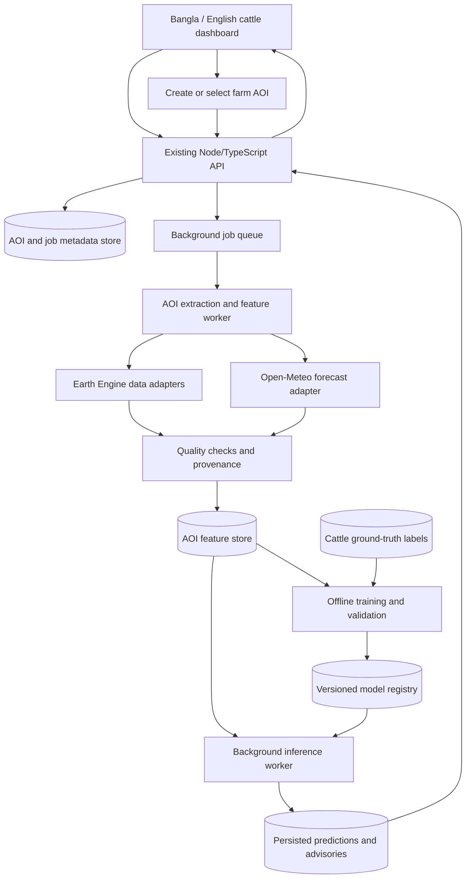

# Cattle AOI and ML Advisory Architecture

**Status:** Proposed implementation architecture. This document does not mean that the AOI workflow, Earth Engine ingestion, or supervised cattle models are already implemented.

**Scope:** Cattle only. Crop-planning flows and other livestock are out of scope.

## 1. Why AOI is the core

Each farm or grazing area needs a stable Area of Interest (AOI) so that weather, satellite observations, labels, and predictions refer to the same place over time. An AOI should be a farm or pasture polygon with an ID, not just a district or upazila name.

The current weather selector uses approximate district/upazila reference coordinates. Those coordinates can support point weather queries, but they do not define a farm boundary or support claims about conditions inside a particular farm. Until a user supplies a farm polygon, the UI must describe any location-based result as a coarse area or point estimate.

## 2. Current repository baseline

- The website is served by the Node.js/TypeScript API in `services/api/src/server.ts`.
- The Weather tab requests a seven-day Open-Meteo forecast from `/api/v1/weather/forecast?lat=...&lon=...`.
- The dashboard contains a Tanore cattle heat warning backed by generated monthly THI summaries for 2023–2025. The source is recorded in `packages/rotation-engine/src/data/tanore_replay_data.ts` as NASA POWER hourly temperature and humidity. It is a historical research summary, not a live per-farm prediction or supervised training set.
- The existing Bangladesh location coordinates are approximate administrative-area reference points, as documented in `README.md`.
- NASA POWER, IMERG, SMAP, and MODIS-related data elsewhere in the project must not be treated as cattle/pasture features until they are joined to a specific AOI, quality checked, and labeled correctly.
- No validated cattle outcome dataset is currently established for supervised training.

## 3. Target architecture



The browser must never call Earth Engine directly, hold Google credentials, train a model, or calculate a prediction from an unverified data sample. It submits an AOI/job request to the API and renders persisted results returned by the API.

### Processing cadence

1. **AOI registration:** Save a validated polygon and stable `aoiId`.
2. **Historical extraction:** A background job extracts available satellite/reanalysis time series for that AOI. Do not run a long Earth Engine reduction during a page request.
3. **Forecast refresh:** Retrieve forecast data for the AOI's representative location using the existing Open-Meteo integration. Cache by AOI/location and forecast issue time.
4. **Feature engineering:** Build timestamped, unit-normalized features with coverage, quality, and source metadata.
5. **Inference:** Run the currently available rule baseline or a validated, versioned model in the background. Persist the result and its drivers.
6. **Training:** Train a task-specific model only as an explicit offline/background job after a suitable labeled dataset exists. Training must not happen on every browser request.

## 4. AOI and data records

### AOI record

Minimum fields:

- `aoiId`, display name, owner/farm ID if available
- GeoJSON `Polygon` or `MultiPolygon` in WGS84/EPSG:4326
- calculated area and representative point
- creation/update timestamps and geometry provenance
- optional district/upazila association for display and coarse fallback

Allow users to draw a polygon or upload GeoJSON. Validate geometry, coordinate bounds, area, and supported country/region. If a polygon is unavailable, allow point-weather advisories only and label their coarser spatial support. Do not silently turn an upazila centroid into a farm AOI.

### Feature record

Every value must be traceable to:

`aoiId + variable + observation interval + source/product + source version + units + aggregation method + valid-pixel coverage + quality status + fetchedAt`.

Store missing values as missing with a reason. Never fill missing data with zero, reuse Tanore values for another AOI, or cache one AOI's result under another AOI's key.

## 5. Data-source guidance

Treat these as candidate sources. Before implementation, verify the current official catalog for collection ID, bands, units, scale factors, quality masks, cadence, spatial resolution, availability, latency, licensing, and known caveats.

| Source | Appropriate use | Limitation to show |
|---|---|---|
| Existing Open-Meteo forecast | Current/hourly/daily weather for the AOI representative coordinates; near-term THI estimate | Numerical model forecast, not an animal measurement or farm weather station |
| NASA POWER | Historical/near-real-time point meteorology for climate context and historical THI features | Point/representative-coordinate data; not arbitrary farm-polygon raster extraction and not a forward forecast |
| NASA GPM IMERG V07 | Precipitation time series aggregated to daily/rolling periods | Approximately 11 km pixels; rate units and provisional/final status must be handled correctly |
| NASA SMAP L4 | Regional surface/root-zone soil moisture context | Approximately 11 km pixels; not a measurement of a small farm's pasture surface or grazing safety |
| MODIS MOD13A1 V6.1 | Vegetation greenness time series, after QA and scale handling | 500 m pixels and 16-day cadence; NDVI is not forage biomass or edible pasture |
| ERA5-Land hourly | Historical/reanalysis weather features and long-term context | Reanalysis, not a future forecast; approximately 11 km pixels |

For small farm polygons, a polygon reducer does not create finer resolution than the source pixels. Record contributing pixel count/coverage and return a coarse-proxy or insufficient-resolution state when appropriate. Use land-cover/pasture masks before describing vegetation as pasture.

## 6. Backend and job contract

Keep the existing Node/TypeScript API as the website-facing API. Add a separate worker boundary for Earth Engine extraction and Python ML if that is the most maintainable option. The worker must be optional for local development when Earth Engine is not configured; the existing website must still start.

Proposed API responsibilities (adapt names to the current server conventions):

- Create/list/get AOIs.
- Enqueue extraction or prediction jobs and return a job ID immediately.
- Read job status and safe error details.
- Read the latest advisory/prediction for an AOI.
- Read provider and model readiness/provenance.

Use job states such as `queued`, `running`, `succeeded`, `partial`, and `failed`. Jobs must be retry-safe and scoped to an AOI. A missing provider or model should produce a clear status, not fabricated fallback data.

## 7. ML boundary and cattle labels

Different outputs need different targets and training data. Do not train one generic model that claims to predict heat stress, forage, water, milk, grazing, and disease together.

| Cattle output | Suitable ground truth before supervised ML |
|---|---|
| Heat-stress prediction | Time-aligned, veterinary-approved animal observations such as respiration/panting score or body temperature, plus relevant animal context |
| Forage availability | Local pasture biomass/quality measurements and a pasture mask |
| Grazing suitability/window | Observed grazing/ground-condition labels and pasture AOIs |
| Water demand | Measured water intake and herd/animal inputs such as count, weight, production/lactation state |
| Milk-loss warning | Historical milk yield linked to heat exposure, breed, and lactation/animal context |
| Disease risk | A named disease, veterinary-confirmed surveillance labels, and validated disease-specific thresholds/features |

The current historical Tanore THI aggregates are not enough to train any of these supervised models. Do not invent labels, train on synthetic rows, report fictional accuracy, or call a threshold rule an ML model.

Until valid labels exist:

- Provide an explicitly named **rule-based THI baseline** from current/forecast temperature and humidity, with a cited cattle-appropriate formula and thresholds. Treat the result as an estimate, not a diagnosis.
- Suggest cooler feeding hours from forecast heat conditions as practical guidance, not as a prediction of an individual cow's appetite.
- Use weather-only water advice as a risk category; do not report precise litres per cow without validated inputs/model.
- Show NDVI only as a greenness proxy unless locally calibrated biomass labels are available.
- Keep milk-loss and disease-specific predictions unavailable until their labels and validation exist.
- For each model target, maintain a separate model artifact and input schema. Version the model, training period, label definition, data sources, and validation metrics.

For model validation, use time-aware and farm-aware holdouts to limit leakage between nearby dates and the same farms. Compare with a simple baseline. Show probabilities only if calibration and held-out validation justify them; otherwise show a risk band and uncertainty.

## 8. Prediction response and frontend

Each result should carry at least:

```json
{
  "aoiId": "<aoi-id>",
  "target": "<task-name>",
  "status": "available | partial | unavailable",
  "riskLevel": null,
  "probability": null,
  "horizon": "<prediction horizon or null>",
  "generatedAt": "<ISO-8601 timestamp>",
  "method": { "type": "rule_baseline | validated_ml | unavailable", "name": "<method-name>", "version": null },
  "drivers": [],
  "data": [],
  "uncertainty": "...",
  "limitations": []
}
```

The UI should show AOI selection/setup, job progress, latest supported advisory, key drivers, source/date/resolution, stale/missing-data warnings, and whether the result came from a rule baseline or a validated ML model. Preserve the existing Bangla/English toggle and all unrelated crop/weather flows. Show useful empty states when no farm polygon, Earth Engine access, ground-truth labels, or model is available.

## 9. Earth Engine access and secrets

Earth Engine requires an appropriately configured Cloud project, API access, registration, and permissions. Confirm the project's access tier and terms for the intended use; do not assume noncommercial/free access or create cloud resources on the user's behalf.

Use server-side authentication such as Application Default Credentials or a properly configured service identity. Keep credentials out of frontend code, source control, logs, and committed `.env` files. If credentials are missing, explain the exact manual setup needed and keep the app usable with an explicit provider-unavailable state.

## 10. Suggested delivery phases

1. AOI polygon storage/creation, job and feature schemas, and source/model readiness states.
2. AOI-specific forecast THI and cooler-hour rule baseline using the existing weather adapter; ensure cache isolation by AOI.
3. Earth Engine extraction adapters with quality/provenance metadata, enabled only after user-side access is configured.
4. Collect cattle/pasture outcome labels and document annotation protocols.
5. Train and validate task-specific models only when the data supports them; then expose versioned background inference.

## 11. Non-goals until the required data exists

- No farm-level soil-moisture claims from a coarse SMAP pixel.
- No forage quantity or quality claims from NDVI alone.
- No exact animal water consumption, milk-loss amount, or disease prediction without the required animal records and labels.
- No claims that a live data call is a trained ML prediction.
- No made-up/sample output presented as real.

## References

- [Earth Engine access and Cloud project requirements](https://developers.google.com/earth-engine/guides/access)
- [Earth Engine authentication](https://developers.google.com/earth-engine/guides/auth)
- [GPM IMERG V07 catalog](https://developers.google.com/earth-engine/datasets/catalog/NASA_GPM_L3_IMERG_V07)
- [SMAP L4 catalog](https://developers.google.com/earth-engine/datasets/catalog/NASA_SMAP_SPL4SMGP_008)
- [MODIS MOD13A1 V6.1 catalog](https://developers.google.com/earth-engine/datasets/catalog/MODIS_061_MOD13A1)
- [ERA5-Land hourly catalog](https://developers.google.com/earth-engine/datasets/catalog/ECMWF_ERA5_LAND_HOURLY)
